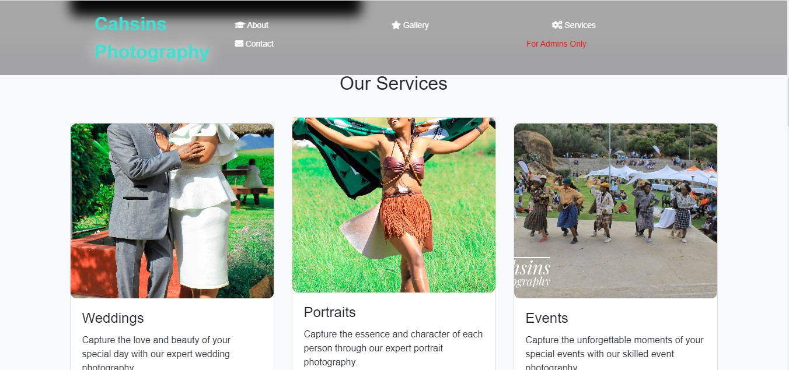
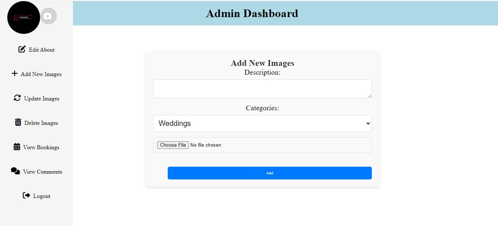

# Projects

## Overview
### Home page

### Admin page

## Technologies Used

- Html
- PHP
- CSS
- Bootstrap

## Contributions

I've contributed to this project, which marks my first significant endeavor outside of class assignments and assessments. My work involves implementing HTML, PHP, CSS, and Bootstrap to create a cohesive and visually appealing website for Cahsins Photography.
